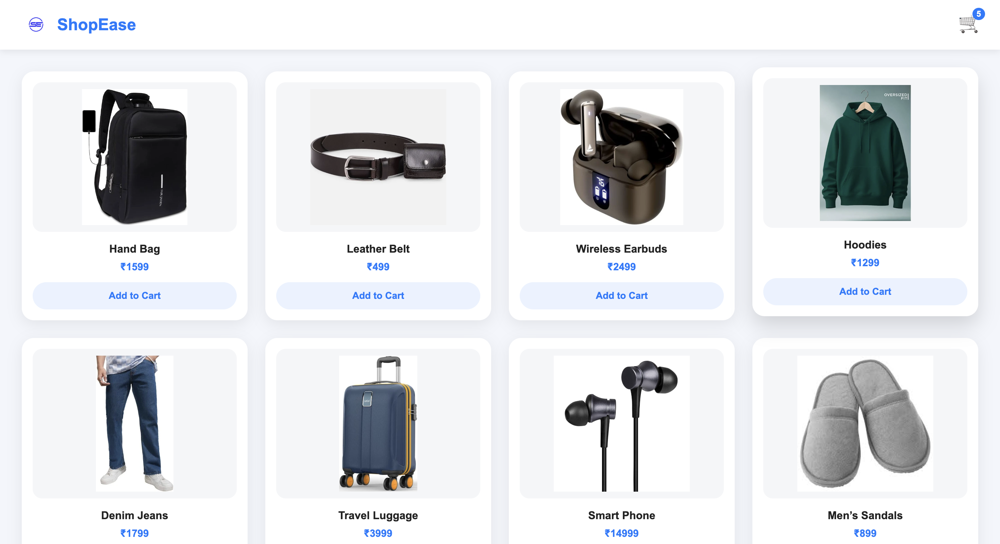
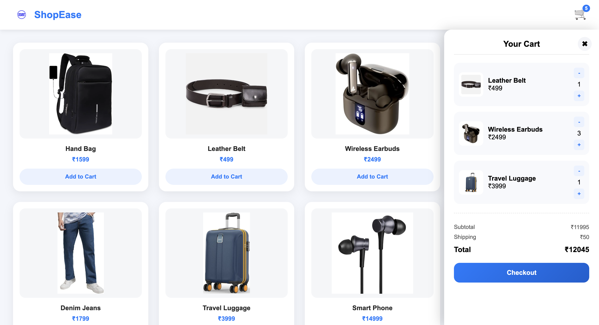

# 🌟 ShopEase - Shopping Cart Web Application

A modern, lightweight e-commerce shopping cart system built using **vanilla JavaScript, HTML, and CSS**. Designed to display products, manage cart items, calculate totals, and provide a clean, responsive UI.

---

## 🚀 Key Features

* **🛒 Shopping Cart Functionality:**
    * Add products to the cart dynamically.
    * Increase or decrease item quantity.
    * Remove items when quantity reaches zero.

* **📊 Cart Summary:**
    * Real-time **subtotal**, **shipping**, and **total** updates.
    * Cart item count displayed in the header.

* **🎨 Modern UI & Responsive Design:**
    * Sticky header with logo and cart icon.
    * Product cards with hover effects and clean styling.
    * Responsive layout for mobile and tablet screens.

* **⚡ Vanilla Tech Stack:**
    * No frameworks, only **HTML, CSS, and JavaScript**.
    * Fully functional offline in the browser.

---

## 🛠️ Tech Stack

| Technology | Purpose |
| :--- | :--- |
| **HTML5** | Structure and semantic markup |
| **CSS3** | Styling and responsive design |
| **JavaScript (ES6+)** | Dynamic functionality and cart logic |

---

## 📁 Project Structure

```plaintext
shopping-cart/
│
├─ index.html       # Main HTML file
├─ style.css        # Styling for the app
├─ script.js        # JavaScript functionality
├─ images/          # Product images (icons, product photos, etc.)
└─ README.md        # Project documentation
```

---

# 📸 Screenshots

### 🏠 Home Page


### 🛒 Cart Drawer (Opened)


---

# 🔗 Live Demo

👉 **https://shopease-6b3g.onrender.com/**

## 💡 Author

**IJJUROUTHU HEMANTH**  
Email: hemanthijjurouthu@gmail.com  
GitHub: [https://github.com/hemanthijjurouthu](https://github.com/hemanthijjurouthu)  
